# Moss · little sloth

A cozy pocket pet, remote desktop, and tiny game console for the
**Waveshare ESP32-C6-Touch-AMOLED-2.16**. Firmware **v1.39** includes a scrollable main menu
and a standalone text/HTML browser over Wi-Fi, alongside roaming pet animations and a bright **Sun Conure**, richer game graphics, and a **Utilities**
menu with Remote Display and passive Wi-Fi/Bluetooth LE explorers. **3-toed
Tetris** supports a short left-button tap to move and a hold to drop, alongside
large Left/Right/Rotate/Drop touch buttons. **Forest Fidget** offers twelve quiet
touch-and-tilt toys; **Leaf Sweep** combines a three-clawed paw, cooling energy
meter, and pace-based scoring. Moss Pong, Tetris, and Leaf Sweep have optional
music/effects, pause confirmation, and persistent named top-ten scoreboards.
The hamburger menu opens **Games**, **Browser**, **Wi-Fi Networks**, **Utilities**, then
**Settings**;
**Back to Pet** is also selectable with the hardware buttons.
Tap the pet for a dry, deadpan joke from a bank of **2,048 lines**, with mood-aware
selection and persistent history. Short PWR presses go back in menus or pause
an active scored game; Forest Fidget returns directly to Games. On pet home PWR
toggles the screen; long-hold power is unchanged.

Companion **v1.7** supports automatic saved Wi-Fi or USB display connections,
optional Mac audio, and a one-second volume bar. Wi-Fi uses persistent pairing,
compression, and changed-area updates. Customize the pet's animal, name,
timezone, and scene; care continues based on elapsed time, including time off.

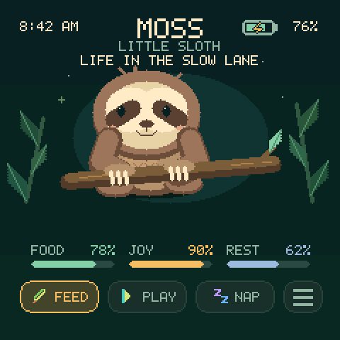

The **Browser** menu opens a standalone text/HTML browser over Wi-Fi, with a URL
keyboard, scrolling, links, Back, Reload, and Stop. Its default address is
`https://news.ycombinator.com`. Tap the address bar and keys
to edit a URL; swipe the keyboard to reach more characters, and drag the page to
scroll. Its toolbar buttons also accept touch. It shares saved networks with
Remote Display. READ mode streams larger text pages and bounded inline JPEG/PNG images through
the microSD cache. Experimental HTML mode supports small pages and basic CSS.
JavaScript, forms, and video remain unsupported. See
[Browser usage, limits, build, and verification](docs/browser.md).

URL entry, Wi-Fi credentials, pet names, and score names use one reusable keyboard.
Its six-column layout shows 30 character keys at once, each 34 × 28 logical pixels (68 × 56 on the
panel), swipe scrolling, and a single row of editing/submit buttons. Use PWR or the top Back control to
cancel an edit. Tap a key or use
Next/Select; hardware focus automatically scrolls into view. Passwords stay masked,
and each editor retains its own length, character, and save rules.

## Download Moss Display for Mac

[**Download the latest Mac app**](https://github.com/alexandriax/esp32/releases/latest/download/Moss-Display-macOS.zip) · [All releases and checksums](https://github.com/alexandriax/esp32/releases)

For **macOS 15 or later**, on Apple Silicon or Intel. Unzip and move **Moss
Display.app** to Applications. Keep the app at that location for updates, allow
**Screen & System Audio Recording** when macOS requests it, and choose
**Utilities → Remote Display** on Moss. This download is the Mac companion;
it does not flash the device. Release notes identify signing/notarization status.

[Build and release workflow](https://github.com/alexandriax/esp32/actions/workflows/moss-display.yml)
checks firmware logic and the companion, builds both Mac architectures, and
publishes verified builds from `main`. See [release setup](docs/releases.md).

## Controls

| Button | Action |
| --- | --- |
| **Right +/KEY** | Pet home and menus: activate the highlighted action or option. |
| **Left BOOT/−** | Pet home: move through Feed → Play → Nap → Menu. Menus: move to the next option. |
| **Either side button while a saying is visible** | Close the saying; press again for the normal control |
| **PWR tap** | Go back in menus, remote display, and Forest Fidget. In an active scored game: pause and confirm before leaving. On pet home: toggle screen off/on. Long-hold power is unchanged. |
| **Left / Right in Forest Fidget** | Previous / next toy, wrapping through all twelve |
| **KEY/BOOT with screen off** | Wake only; press again for its normal action |
| **Tap a screen button** | Feed, Play, Nap/Wake, or open the hamburger menu |
| **Tap the pet or its speech bubble** | A fresh joke or pun, chosen with its food, joy, rest, and nap state in mind |
| **Shake deliberately back and forth while awake** | Falling leaves, a four-second dance, +8 food and +12 joy |

Feed gives Moss leaves; Play makes Moss happy; Nap toggles sleep and restores
**one rest point every three seconds** (20 per minute), including time away while
Moss is sleeping. Food falls by **one point every three minutes**, and joy falls
by **one point every five minutes**. The on-board clock lets these needs continue
while the device is off; the next start applies the elapsed time using Moss's
last saved sleep state. Moss never dies.

The meters show percentages for food, joy, and rest; the sleeping rest bar has a
moving highlight. A snack or game wakes Moss. Shakes during a nap are ignored:
Moss stays asleep, earns no shake rewards, and keeps resting. The screen dims
after **one minute** and turns completely off after **two minutes** of inactivity.
While dimmed, KEY/BOOT, touch, or an awake shake restores brightness; a short
PWR tap on the pet home turns it off. Once off, KEY/BOOT wake without activating
a choice. PWR wakes the pet home, or wakes and goes back when inside a menu.
Moss's nap is preserved. Wake takes about a second.
Touch and shake inputs are inactive while the screen is off.

Tap and release a screen button to act. Holding or dragging across buttons does
not repeatedly trigger actions. Shake detection requires three alternating
motion peaks within 1.2 seconds, plus a four-second reward cooldown and a brief
settling interval. Sensitivity is adjustable, and missed between-sample zero
crossings no longer prevent opposite-direction peaks from counting. Use a short, deliberate back-and-forth gesture. Food and joy
stop at 100%; an awake shake still dances when both are full.

Actions queue a prompt save in the main loop, outside the display callback, and
progress also saves every minute. Each checksummed v3 record stores Moss's state
and its matching UTC timestamp together. Existing v1 and v2 saves migrate
automatically, preserving the food, joy, rest, and sleep state. Their old offline
time cannot be reconstructed because those versions did not save timestamps.
No account, network, or microphone is required; physical buttons remain usable.

## A little personality

Awake pets now look around, stroll or hop between nearby spots, groom, briefly
doze, and return home. Sloths move slowly, cats swish their tails, frogs hop, and
the Sun Conure flutters, preens, and perches. Scenes include gentle foliage,
water, or sky movement. These are visual animations: an idle doze does not
toggle Nap or change care levels. A sleeping pet keeps resting, and the care
meters and controls remain fixed while the animal wanders.

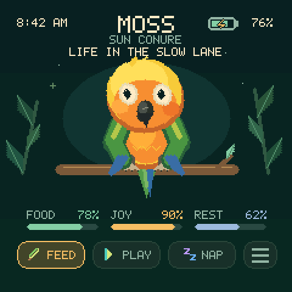

Tap the animal on the pet screen for a thought. The speech bubble fits the
wrapped text in both width and height and overlays the lower part of the
full-size pet. The clock, battery, status line, care meters, and controls stay
visible. Tap the pet or bubble for another line; each stays for 10–22 seconds
according to its length. Each saying starts a four-second gesture from a
shuffled set of twelve: shrug, wave, facepalm, head tilt, nod, stretch, peek,
giggle, sway, point, heart hands, and slow clap. Every gesture appears once
before the set reshuffles, with no immediate repeat across sets. The set is
shuffled afresh at startup; the joke history remains persistent. Sleeping pets
keep resting instead of performing the awake gestures. Care actions or opening
the menu clear the bubble. Either side hardware button also dismisses a visible saying;
that press only closes it, without moving the selection or activating care.
Talking during a nap leaves the pet asleep, and ignored
sleeping shakes leave its bubble alone. Jokes do not change care levels.

The bank includes sloth humor, wordplay, and observations about bureaucracy,
work, technology, money, social life, science, food, and sleep. All 2,048 lines
are stored in firmware and available offline. Selection prioritizes freshness:

- Each line is used once before the whole bank starts a new cycle.
- The last 64 lines are excluded across cycle boundaries. Related premises are
  spaced across the last 24 selections where possible, and recent topics are
  discouraged to keep the conversation varied.
- Low food favors appetite jokes; low joy favors bored or play-related lines;
  low rest favors tired humor. Full, happy, rested, and napping states have
  matching preferences. All categories remain available, so mood never locks
  the pet into a small repeated pool.
- A checksummed history record saves the unseen pool, random state, and recent
  selections before a new line is shown. Restarting or reinstalling the same
  bank preserves progress. A changed bank starts a fresh history safely.

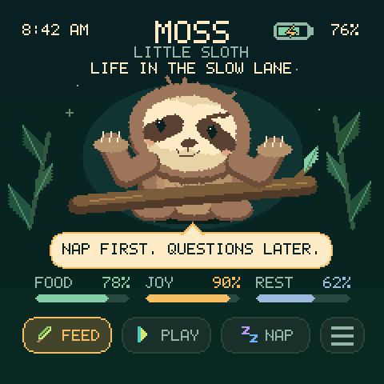

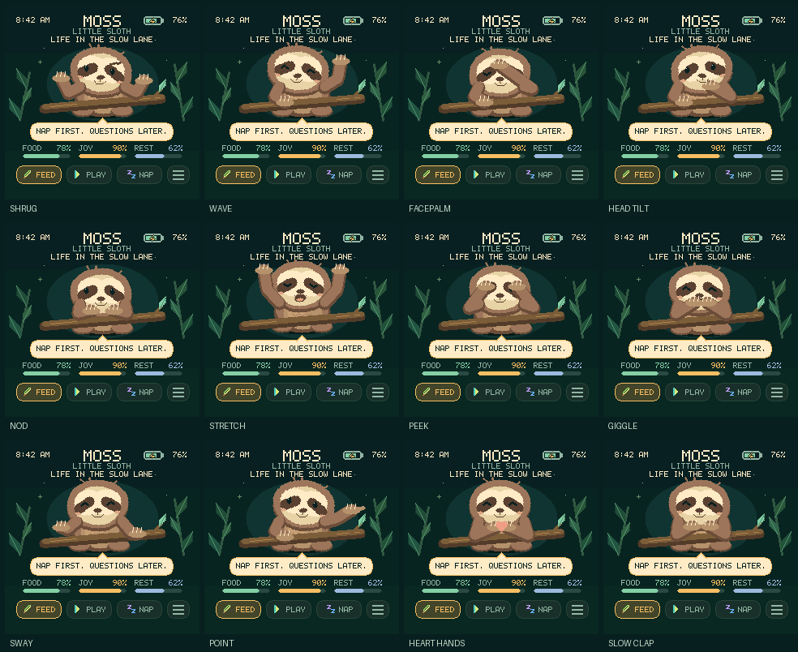

The editable sources are `content/humor/general.jsonl` and
`content/humor/personality.jsonl`. Each entry has a stable source ID, text,
semantic mood, topic, and shared-premise family. `shared_families.json` links
related premises across the two source files. Run
`python3 scripts/generate_humor.py` after edits. The generator rejects duplicate
normalized text, unsupported glyphs, and lines that would not fit the card;
builds and tests check that the committed C++ bank matches its sources.

## Games and menus

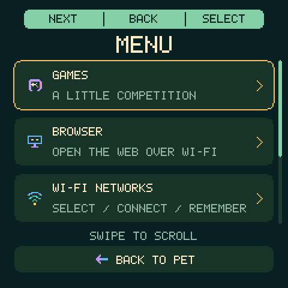
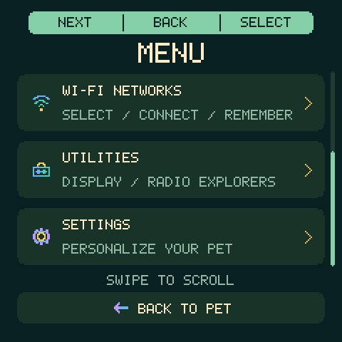

The main menu shows three roomy rows at a time. Swipe up or down to reach all
five entries; the header and Back to Pet stay fixed. A scrollbar shows your
position. Hardware Next scrolls the highlighted row into view automatically.

The top strip matches the buttons from left to right: **Next / Back / Select**.
Shared multicolored pixel icons identify games, settings/choices, remote connection options,
care actions, confirmation buttons, and keyboard actions while retaining labels.
It is also touchable. Every menu includes its Back option in the hardware focus
cycle, including **Back to Pet** on the main menu. The order is **Games**,
**Browser**, **Wi-Fi Networks**, **Utilities**, **Settings**, then **Back to Pet**. Utilities
contains Remote Display and the two radio explorers. Pet controls and live
desktop volume controls keep their existing mappings.

**Games → Moss Pong → Play** opens the two-player game. Front-left **BOOT/−**
controls P1's leafy paddle; front-right **+/KEY** controls P2's. Either button
serves the fruit ball. A press sends that paddle toward the opposite edge;
another reverses it. Paddles stop at the edge until pressed again. First to
seven wins. Moss rests with lowered pom-poms, then cheers for 1.2 seconds when
either player scores, with a brief shower of leaves. Shaded paddles and a fruit
ball trail make motion easier to follow. **Sound / Options** sets each player's paddle speed
independently from 1 (Snoozy) to 5 (Zoom).

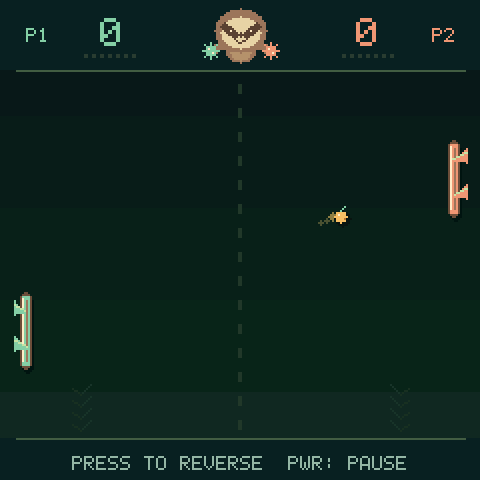
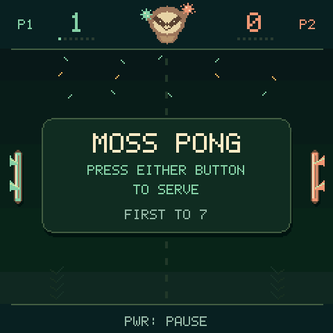

**Games → 3-toed Tetris → Play** starts a single-player falling-block game:

- **Left BOOT/−, short tap:** releasing before 650 ms moves the current piece
  one column right. At the right edge, another tap wraps it to the leftmost
  position where it fits. A settled block in the middle blocks movement; pieces
  never jump through the stack.
- **Left BOOT/−, hold for 650 ms:** hard-drop the current piece once at its landing
  outline, with no initial sideways move. Continuing to hold or releasing after
  the drop cannot move or drop the next piece. Pause, wake, and piece changes
  cancel an in-progress hold; release before trying again.
- **Right +/KEY:** rotate clockwise, with wall and floor kicks where possible.
  Holding this button does not repeat rotations.
- **Touch Left / Right:** move one column, stopping at walls and settled blocks.
  Touch Right does not wrap; the hardware Move button retains its wraparound.
- **Touch Rotate:** rotate clockwise, just like the hardware button.
- **Touch DROP:** place and lock the current piece immediately at its landing
  outline, without moving sideways. One tap drops one piece; the next piece
  waits for a new tap. Drop awards no extra points; line scoring is unchanged.
- The four touch buttons are 48×42 logical pixels (96×84 panel pixels), with
  12-pixel logical gaps between them. Gaps and the playfield ignore taps. Buttons
  act on release, and sliding between buttons cancels the gesture. A contact
  begun on a piece that gravity subsequently locks cannot act on the next piece.
  The score, lines, level, framed next-piece preview and blinking sloth sit above the
  controls; all twenty board rows remain visible.
- Pieces fall automatically. A landing outline shows where the piece will
  settle, and the next piece appears beside the field. Each shuffled set contains
  all seven shapes. A 350 ms locking delay gives time for a final adjustment;
  repeated movement can reset that delay at most 15 times.
- Clearing one/two/three/four rows earns 100/300/500/800 points times the current
  level. Every ten cleared rows increases the level and falling speed. A full
  spawn area ends the game.

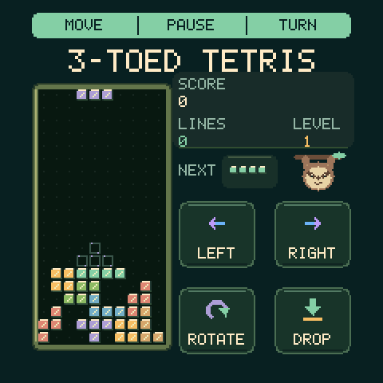

**Games → Leaf Sweep → Play** is controlled entirely by touch:

- Tap leaves or drag across them to collect them. A three-toed sloth paw with
  curved claws follows your finger. Collected leaves regrow; small sprouts need
  half a second to mature. The leaf meter fills every 25 leaves, then starts
  the next round. There is no final leaf limit.
- Avoid the pink energy-drink cans with lightning bolts. A warning ring appears
  for 0.7 seconds before a can becomes dangerous. Each hit adds **25 energy**;
  that can disappears. Energy cools by **3 per second**, and reaching **100**
  ends the run. New objects avoid spawning underneath a resting paw.
- The score rewards collection pace across the entire active run:
  `floor(leaves × 6000 / (active seconds + 20))`. The displayed multiplier starts
  at **3.00×**, reaches **1.00×** at 40 seconds, and continues fading. Ten leaves
  in ten seconds score 2,000; twenty over a minute score 1,500. **Waiting can
  lower the score**. Pausing freezes the clock, and the final score freezes at
  game over.
- Swept collision checks include the entire path between touch samples, even
  when a stroke exits the field. Lifting and touching elsewhere starts a fresh
  stroke. The on-screen Pause button and PWR both open the exit confirmation.

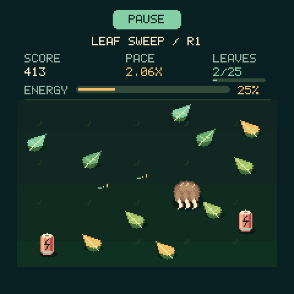
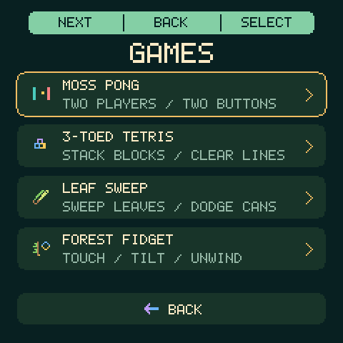

In Pong, Tetris, and Leaf Sweep, a **short PWR tap pauses and asks before leaving**. Continue is
selected by default; select it or tap PWR again to resume exactly where you left
off. Select Leave Game to return to the game's menu. An unfinished game is not
added to the scoreboard. Music and effects stop while the confirmation is open.
The screen stays awake during play, and pet care continues in the background.

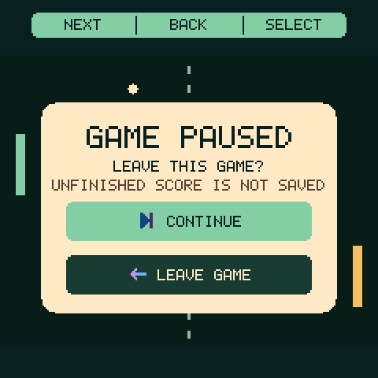

Each scored game's **Sound / Options** has independent **Music** and **Effects** switches,
saved immediately. Music starts off and effects start on; turn both off for
silence. All three games use original, gentle synthesized music and short game cues.
These switches and the game speaker volume are separate from Remote Display's
Mac audio settings. The speaker is released when leaving a game.

After a completed game, press either side button to continue; Leaf Sweep also
accepts a fresh tap after the final swipe has been released. A qualifying
score opens a name keyboard: enter up to ten letters/digits/spaces, accept the
default name, or Skip. The large-key keyboard scrolls vertically to reach all
letters and numbers; Space, Delete, Clear, Save, and Skip remain fixed.
Touch registers on release, and swipes scroll without typing. Hardware Next
scrolls the selected key into view. Back returns to the final result without
discarding it. **High Scores** shows the best result and ten
ranked entries, five per page, and survives power-off and firmware updates.
Pong ranks completed winning scores by margin (7–0 above 7–6); the name belongs
to the winner. Tetris ranks by points, then cleared lines; Leaf Sweep ranks by
its final pace score, then total leaves. Exact ties keep older entries first.
Scores and sound settings use a separate checksummed record,
preserving pet settings, elapsed care, and joke history. Existing two-game saves
migrate without losing scores or sound preferences.

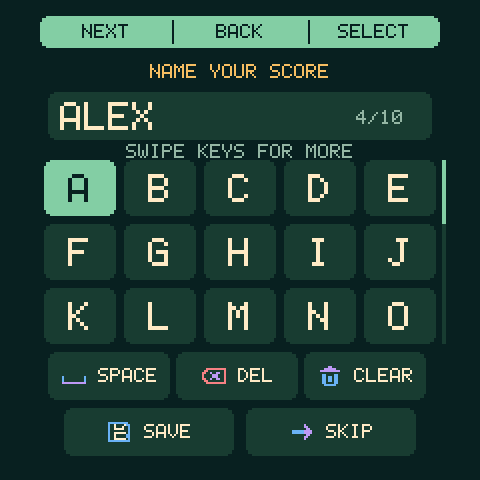
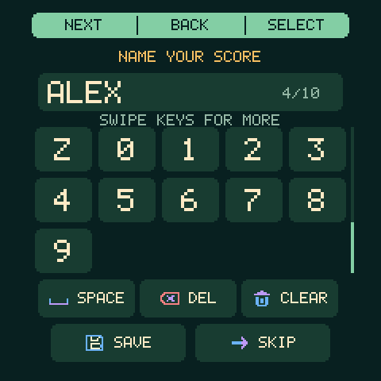
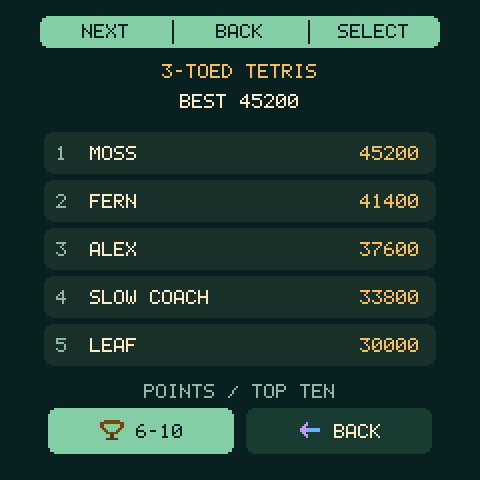

### Forest Fidget

**Games → FOREST FIDGET** opens twelve quiet, open-ended toys. **Left BOOT/−**
chooses the previous toy and **right +/KEY** chooses the next, wrapping at either
end. The top **Prev / Back / Next** strip also responds to taps. A short **PWR**
tap returns directly to Games. There are no scores, leaderboards, timers, or
failure states. Each visit starts a fresh arrangement.

| Toy | Interaction |
| --- | --- |
| Dew Pond | Tap or swirl to spread ripples across lily-pad water |
| Acorn Roll | Tilt to roll and collide; drag and flick the acorns |
| Mushroom Pop | Press springy caps and watch them rebound |
| Fern Brush | Stroke and bend the fronds, then let them unfurl |
| Firefly Jar | Lure glowing fireflies with a finger; tilt to swirl them |
| Pinecone Spin | Turn the pinecone and release it to spin |
| Pebble Stack | Drag stones into a stack or tilt to tumble them |
| Moss Squish | Press and stroke the cushiony moss |
| Leaf Globe | Tilt or swipe to stir a miniature leaf storm |
| Vine Swing | Pull the sloth on its vine, release, and watch it swing |
| Rainstick | Tilt bouncing seeds through pegs; tap for a fresh shower |
| Zen Rake | Draw fading grooves in sand; tilt to soften them |

Every toy supports touch, including when motion readings are unavailable.
V1.28 corrects the inverted top/bottom tilt direction and adds material shading,
glass reflections, firefly wing motion, and gentle impact cues.
The screen stays bright while Forest Fidget is open; use PWR to leave when
finished. Pet care continues in the background, and motion here does not feed
or wake the pet. Forest Fidget is silent and has no saved sound preferences.

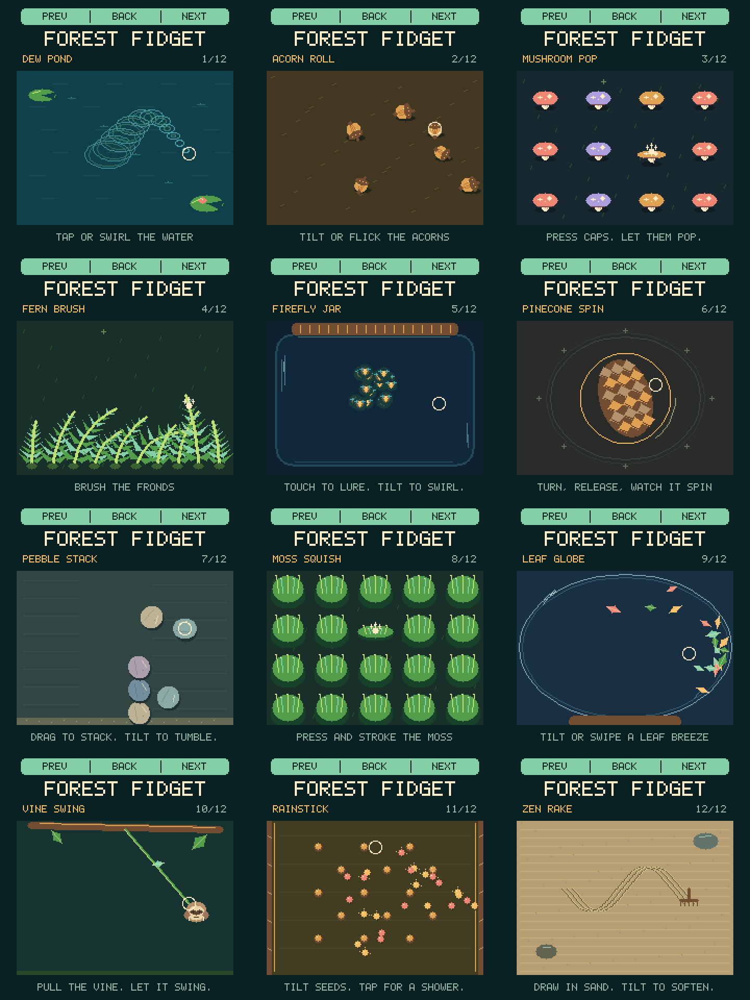

## Utilities and radio explorers

**Menu → Wi-Fi Networks** scans for nearby 2.4 GHz networks. Select a network
and enter its password, or choose **Manual** for a hidden network. A successful
connection saves one network on Moss for later Remote Display use. The saved
network stays at the top for reconnecting without retyping; **Rescan** refreshes
the list, and **Forget** asks before removing its credentials. Changing or
forgetting the network preserves the trusted Mac pairing. Back/PWR returns
through the credential screens to the menu.

**Menu → Utilities** contains **Remote Display**, **Wi-Fi Explorer**, and
**Bluetooth Explorer**. Remote Display keeps its automatic Wi-Fi/USB selection;
the explorers are separate, passive discovery tools.

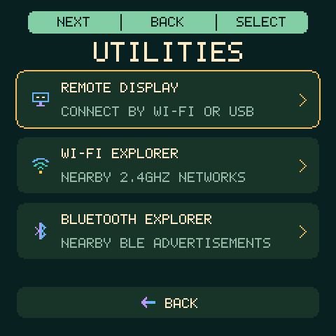

- **Wi-Fi Explorer** lists nearby **2.4 GHz** access points with signal strength.
  Select one for its name, BSSID, channel, and security type. Hidden names may be
  unavailable because the device only listens for beacons.
- **Bluetooth Explorer** listens for **Bluetooth LE advertisements**. Details
  include the advertised name, public/random address type, RSSI, advertised
  transmit power when present, service summary, and a bounded hexadecimal
  payload preview. Names and other fields are absent when the device does not
  advertise them. It does not scan Bluetooth Classic devices.
- Swipe to scroll, tap a row for details, and use **More** to page through a
  detail screen with the hardware controls. **Refresh/Scan** requests fresh
  discovery; **Back/PWR** returns to the list, then Utilities. Lists retain at
  most 24 entries in stable order until refreshed.

On a selected device's detail page, hold Moss upright and slowly turn left,
right, and back. The gyro matches those turns with fresh RSSI observations.
Only a sufficiently consistent sweep produces **Stronger on Left/Right**;
otherwise it shows **No Clear Direction**. This compares signal strength over
a recent turn. It is **not a compass bearing, distance estimate, or reliable
device locator**: walls, reflections, antenna orientation, and your hand can
dominate the result. Physical directional accuracy has not been established.

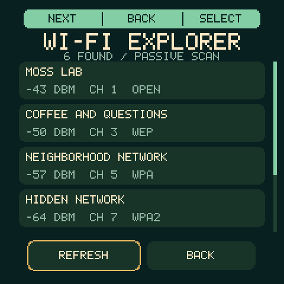
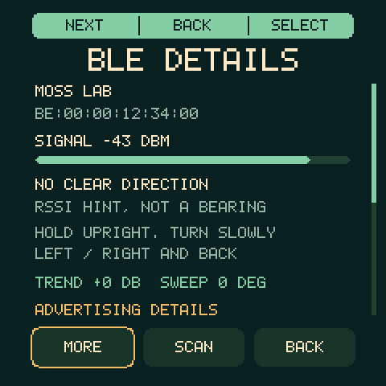

The explorers do not join networks, pair, open BLE connections, request scan
responses, or save discovered names/addresses. They use separate radio ownership
from Remote Display and stop scanning when left or when the screen sleeps.
Pet care continues in the background; scanning itself does not keep the screen
awake or award shake rewards.

## Make it yours

Tap **Menu beside Nap → Settings**, choose your options, then **Save**.
**Screen Rotation** offers **0°, 90°, 180°, and 270° clockwise**. It applies after
Save and survives restart. Pet home, games, menus, keyboards, browser pages and
Remote Display all use the same orientation. Touch and tilt controls follow the
rotated screen; physical button roles stay the same.

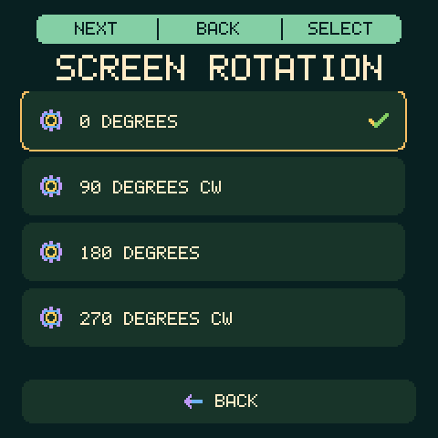

**Cancel**, or PWR from the Settings root, discards the draft. PWR from a
settings subpage returns to the settings list; Save applies the draft and returns
to the main menu. Hardware controls also work throughout the menu:
**Left BOOT/−** moves the highlight and **right +/KEY** selects it. Swipe up/down to scroll
the settings list, scene/time-zone choices, or the larger name keyboard. Hardware
navigation automatically scrolls the selected control into view; Save/Cancel
stay fixed at the bottom. A swipe never also selects a control.

- **Animal:** Sloth (default), Cat, Frog, or Sun Conure, each with its own animations and snack.
- **Name:** up to 12 letters, numbers, spaces, hyphens, or apostrophes. Tap Delete
  to remove letters; **123 / ABC** switches keyboards. **Use Name** accepts the
  name into the draft; the main **Save** button stores all settings.
- **Time zone:** Eastern (default), Central, Mountain, Pacific, UTC, London,
  Paris, India, Tokyo, Singapore, Sydney, Auckland, Phoenix, or Hawaii.
- **Subtitle:** show or hide “Little Sloth,” “Little Cat,” “Little Frog,” or “Sun Conure.”
- **Shake:** choose Very Low, Low, Normal (default), High, or Very High
  sensitivity while viewing live motion diagnostics.
- **Scene:** Jungle (default), Meadow, Night, NYC, Space, Island, or Under the Sea.
  Swipe to browse the continuous list.
- **Storage:** view onboard flash capacity, firmware usage against its reserved
  space, and saved-data usage. A readable microSD card shows filesystem capacity,
  used space and free space. **Refresh** checks again after inserting/changing a
  card; **Back** or PWR returns to the Storage row without changing your draft.

Storage checks run in the background and do not create, delete or format files.
Onboard flash is split into firmware and saved-data areas, rather than a single
file drive. Firmware usage is the current image size; saved-data usage counts
occupied 32-byte NVS entries, including entry metadata, against total entry space.
Unused flash outside those areas is not shown as writable file storage. Sizes
use binary KiB/MiB/GiB. The card slot has no connected card-detect signal, so a
failed card response is shown as unavailable instead of claiming a card is absent.

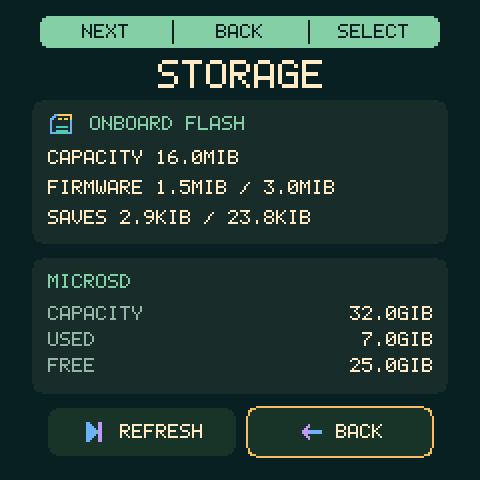

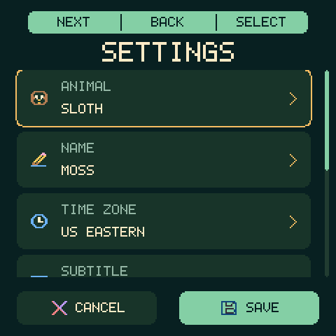
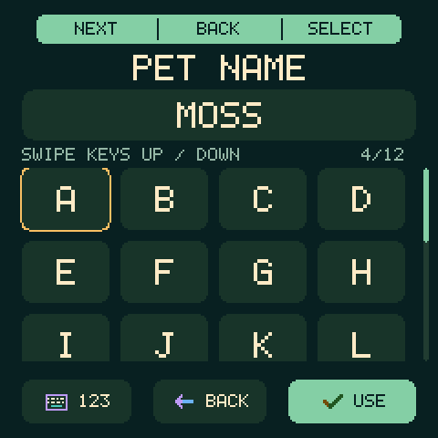

Settings survive a restart without resetting food, joy, rest, or naps. The menu
keeps its draft when the screen sleeps; press a hardware button to resume it.
Shaking and care shortcuts are inactive while editing. New names use uppercase
keyboard letters; the display uses uppercase for every name.


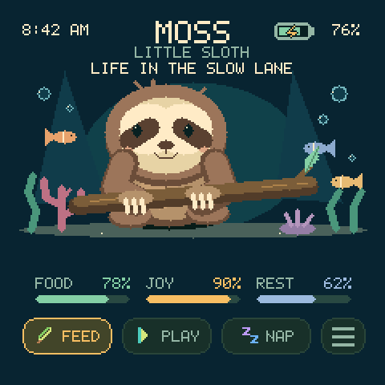

## Tune shaking

Open **Menu → Settings → Shake**. Use **Less / More** to change the sensitivity and make a
short back-and-forth shake. **Detected!** and the test count show that the gesture
would trigger care on the awake home screen. **Back → Save** stores your choice;
Cancel discards it. The Normal default is easier to trigger than the old fixed
threshold. Very High needs less movement; Very Low needs stronger movement.

The page shows raw X/Y/Z acceleration in g, total acceleration, motion strength,
peak motion, the selected threshold, sample rate, and a bubble level. Tilting a
stationary device moves the level; roughly 1 g total at rest is gravity, not a
shake. The accelerometer is configured for ±4 g at 125 Hz; displayed sample rate
is the actual firmware polling rate. The level is gravity-based and will move
during acceleration too. Missing/stale readings are marked rather than shown
as live data.

Testing works during naps and awards **no food or joy**. Outside settings,
shake rewards still require an awake pet and a visible screen. Between trials,
let the device settle and allow the four-second cooldown. Test counters reset
on opening the page, changing sensitivity, or waking the screen.

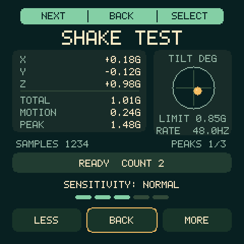

## USB extended display (Mac)

Open **Moss Display.app** on the Mac, connect the device by USB, then choose
**Menu → Utilities → Remote Display** on the device. Allow **Moss Display** in macOS **System
Settings → Privacy & Security → Screen & System Audio Recording** when prompted.
If macOS asks to quit/reopen the app, do that and select Remote Display again.
The app appears as **Moss** in the Mac menu bar.

The new **Moss USB Display** starts to the right of your other displays; use the
app's **Display Settings…** menu to arrange it. The **Moss** menu offers:

- **Desktop size:** 800 × 800 (default, larger interface) or 960 × 960 (more
  workspace), applied on the next connection. Both are also advertised to macOS.
  This Mac rejects 480 × 480 and 720 × 720 as usable desktop modes.
- **Image quality:** **Sharp · 480 × 480** (default) or **Fast · 240 × 240,
  enlarged**. Switch live while connected. Fast sends one-quarter as many pixels,
  with less detail; it requires firmware v1.9 or later.
- **Compression:** **Adaptive · faster motion** (default) uses JPEG when it
  substantially reduces Wi-Fi traffic in Fast mode, then restores exact colors
  when motion stops. **Lossless · exact colors** disables JPEG. Sharp and USB
  always use lossless compression.

Desktop size and transfer resolution are independent. A smaller desktop makes
the interface larger, but does not by itself reduce USB traffic. The physical
screen always fills 480 × 480 pixels. Changed-region detection selects the
smallest raw, run-length, or LZ4 encoding; v1.12 also crops unchanged columns.
Capture can supply up to 30 fps, while device pacing determines actual updates and drops
obsolete queued frames. No unbounded frame queue builds up.

On-device **synthetic** benchmarks (transfer time, not guaranteed desktop fps):

| Update | Time |
| --- | ---: |
| Full flat UI, old raw 480 transfer | 2.06 s |
| Full flat UI, compressed 480 transfer | 0.12 s |
| Full random image, 480 / Fast 240 | 2.01 s / 0.59 s |
| Changed two native rows | 0.009 s |

Text, clocks, and cursor movement benefit most. Full-screen photos or motion can
remain slow. Bluetooth LE's 2 Mbps maximum raw link rate offers little headroom
over the measured USB pipeline. Wi-Fi display support is now available.
Espressif reports 20 Mbit/s TCP reception in its over-air C6 benchmark; actual
Moss streaming performance must be measured on the local network.
[Chip specifications](https://www.espressif.com/sites/default/files/documentation/esp32-c6_datasheet_en.pdf),
[Wi-Fi benchmark](https://docs.espressif.com/projects/esp-idf/en/latest/esp32c6/api-guides/wifi-driver/wifi-performance-and-power-save.html).
The Wi-Fi setup below uses USB pairing and authenticated TLS.

In display mode, press **right (+/KEY)** for volume up or **left (BOOT/−)** for
volume down, in five-point steps from mute (0%) through the existing 60% limit.
Each press shows a volume bar for one second, including at either limit; another
press restarts the timer. The level reads, for example, **35/60**, so a full bar
means the supported maximum. It appears over the live desktop. Connection/setup
screens use KEY/BOOT for menu navigation.
Changing volume does not turn optional audio on. Sound is supported in Wi-Fi
mode; USB display can adjust the saved volume for later use. These buttons no
longer rotate or exit the desktop. Orientation follows **Settings → Screen Rotation**.
A short **PWR** tap ends the session and returns to Remote Display connection
options with the screen on. A second PWR tap returns to Utilities. The Mac removes the virtual display; hardware long-hold power remains
unchanged. The app's **Disconnect display** menu also ends the session. Pet care and naps keep
advancing in the background.
Touch on the device does not control the Mac.

This needs the companion: the ESP32-C6's fixed
[USB Serial/JTAG interface](https://docs.espressif.com/projects/esp-idf/en/release-v5.2/esp32c6/api-guides/usb-serial-jtag-console.html)
cannot identify itself as a standard USB monitor. The app captures **only its own
virtual display** and sends pixels directly over USB or authenticated Wi-Fi.
Optional Mac audio is available in Wi-Fi mode; microphones are never captured.
It does not install a driver, background service, or startup item.
The virtual-display API is private (also used by
[Chromium's display tests](https://chromium.googlesource.com/chromium/src/+/HEAD/ui/display/mac/test/virtual_display_util_mac.mm));
future macOS releases may require changes. The app targets macOS 15 or later.

Build and open the companion locally with Xcode Command Line Tools installed:

```sh
./scripts/configure-display-signing.sh
./scripts/build-display-host.sh
open "build/macos/Moss Display.app"
```

The companion is signed with the configured **Developer ID Application** identity.
Switching from the previous ad-hoc build may require one final Screen Recording
approval; subsequent builds keep the same Apple/team/bundle signing identity.
See [stable signing](docs/macos-signing.md). macOS can still issue its own periodic
privacy reminders.

Keep the app running during use. **Quit Moss Display before flashing, clock
synchronization, or opening a serial monitor**; it owns the USB port exclusively.
Unplugging or stopping the companion ends the display session after a short
timeout. Without a companion, the waiting screen retains the normal two-minute
screen-off timeout. See [USB protocol](docs/display-protocol.md) for framing,
recovery, and receiver tests.

To repeat the synthetic benchmark, quit the companion, choose Remote Display → Use USB on the
device, then run `.tools/venv/bin/python tools/benchmark_display.py /dev/cu.usbmodem1101`.
It shows test patterns and returns to the existing Settings draft; it captures
no desktop or network traffic.

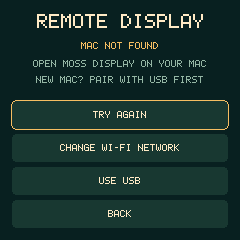

[Volume bar preview](docs/volume-preview.png)

## Clock and power

The upper-left clock shows your chosen time zone in AM/PM format, without a zone
label. Named zones adjust automatically for daylight saving. The pet's clock and
care calculations stay in UTC, independent of this preference.
The upper-right battery icon and percentage fit on one line. A lightning bolt
inside the icon means external USB power is present, including when the battery
is full. Unavailable or invalid gauge readings show a placeholder.
Battery status refreshes every five seconds without changing charging settings.

Screen-off puts the AMOLED controller into sleep and stops frame rendering and
touch/motion polling. The pet's care clock and saves continue, so naps restore
rest and food/joy still decline. The processor remains running to detect all
three buttons, including the PWR button through its power controller. This is
display sleep; battery-runtime improvement has not been measured.

Flashing with `scripts/flash.sh` automatically runs `scripts/sync_clock.py` to set
the on-board clock from the computer's UTC time and verify its readback. To sync
manually after connecting USB:

```sh
.tools/venv/bin/python scripts/sync_clock.py /dev/cu.usbmodem1101
```

Use the device's current `/dev/cu.usbmodem*` port; its name can change after
reconnecting. The clock retains time while USB or the main battery supplies
power. After losing all power, Moss shows **USB clock sync needed** if the clock
is no longer valid. Care continues while powered on, and the firmware skips any
unknown offline interval instead of guessing a penalty. Synchronizing establishes
a new timestamp without retroactively changing care already given that session.
The first upgrade from a v1/v2 save also needs this clock synchronization.

## Local development

Tested on Apple Silicon macOS with Arduino CLI 1.5.2-rc.1, Arduino-ESP32 **3.3.0**,
and esptool **4.9.0**. The compiler and Python environment live under `.tools/`.
The custom partition table reserves **8 MiB** for the factory app at `0x10000`
in the board's **16 MiB** flash. This is reserved capacity, not the installed image
size; Settings → Storage reports both. V1.28 expands the old app allocation while
preserving core NVS at `0xFE0000`, pet NVS at `0xFF0000`, and the original factory
configuration at `0x9000`. Flashing writes only the bootloader, partition table,
and application sectors; it does not erase saved care, settings, jokes, scores,
or wireless pairing. No PSRAM is needed. The browser build also requires CMake
3.24+ and Make or Ninja; it downloads and verifies a pinned libwebsockets source
archive on the first build.

```sh
./scripts/test.sh
./scripts/build.sh
./scripts/flash.sh /dev/cu.usbmodem1101
.tools/venv/bin/python scripts/monitor.py /dev/cu.usbmodem1101 --seconds 15
```

For a fresh checkout, download Arduino CLI from https://arduino.github.io/arduino-cli/
into `.tools/arduino-cli`, then run from the repository root:

```sh
.tools/arduino-cli core update-index --config-file arduino-cli.yaml
.tools/arduino-cli core install esp32:esp32@3.3.0 --config-file arduino-cli.yaml
python3 -m venv .tools/venv
.tools/venv/bin/pip install -r requirements-tools.txt
```

USB diagnostics:

| Command | Result |
| --- | --- |
| `s` | Print state, sensor readings, accounted time, local clock, battery, and settings |
| `w` | Save the current state and print it |
| `t` | Read the RTC and clock synchronization status |
| `T<utc>` followed by a newline | Set UTC Unix seconds, anchor the current state, and save |
| `f`, `p`, `n`, `h` | Feed, Play, Nap/Wake, or the shake reward/dance |
| `q` | Request a joke through the pet-tap handler; ignored in menus or with the screen off |
| `o`, `v` | Force screen sleep / wake-only for display testing |
| `b` | Simulate PWR: back through menu/game/remote screens; home toggles screen |
| `u`, `j`, `k`, `x` | Open menu, next/right-player, select/left-player, back |
| `[`, `]` | Exercise front-left BOOT / front-right KEY routing for the current screen |
| `I` | Read-only heap-integrity diagnostic |
| `{`, `}` | Start/release the guarded Tetris left-button hold diagnostic; a hold drops once after 650 ms and expires after three seconds |
| `d` | Toggle one-second diagnostic output for touch/IMU testing |
| `L<down>,<x>,<y>\n` | Local Tetris / Leaf Sweep / Forest Fidget / game-overlay / radio-explorer touch sample: down is 0/1, coordinates are logical 0–239; uses the same guarded handler as touch |

Use the sync script for routine clock setting; it supplies the current timestamp
and checks the result. For example, append `--send p` to the monitor command to
play with Moss. Care commands change the actual pet.
Status includes the screen state, idle time, and frame count. Read-only queries
do not reset the screen timeout. Care commands are ignored while the screen is
off; `v` wakes it before USB care testing.
The preview tools render the same graphics code to `build/host/*.ppm` during
tests, including dance, settings, and menus. To regenerate the main menu after
building the tools, run `build/host/utility_preview build/host/utility-menu.ppm menu`.
`docs/menu-preview.png` is a lossless 480×480 PNG conversion of that output.
Sensor polling uses the existing shared I2C bus; an unavailable sensor leaves
the other controls working.

## Original firmware and recovery

The original **full 16MB flash** is saved locally as
`backups/original-esp32c6-16mb.bin`, with `backups/SHA256SUMS` and read/verify logs.
This backup passed a device-side digest comparison before the first installation.
Backups can contain private device configuration and are deliberately Git-ignored.
Keep this folder if moving the project to another computer.

To restore the entire original firmware, including its data (this replaces Moss
and its saved progress):

```sh
shasum -a 256 -c backups/SHA256SUMS
.tools/venv/bin/esptool.py --chip esp32c6 --port /dev/cu.usbmodem1101 --baud 921600 \
  write_flash 0 backups/original-esp32c6-16mb.bin
```

If USB upload cannot connect, disconnect power, hold **BOOT/−**, reconnect USB,
then release BOOT and retry. Avoid holding BOOT during ordinary power-on, since
it selects the ROM downloader. The USB port name can change after reconnecting.

See [hardware notes](docs/hardware.md) for verified pins and vendor sources.
See [device verification](docs/verification.md) for the checks and USB reset fix.
The display driver retains its Apache-2.0 license and attribution in
`firmware/sloth_pet/src/vendor/`. Tool downloads, build outputs, and device backups
stay outside Git; source, tests, documentation, and the preview are committed.

## Remote Display (firmware v1.28 / companion v1.6)

Choose **Menu → Utilities → Remote Display**. Moss prefers its saved Wi-Fi network, even
with USB connected. If Wi-Fi cannot reach the Mac, it tries USB when attached.
With no saved network it uses USB immediately, or opens the on-device network
picker when no USB connection is available. Only a companion handshake starts
streaming; a charging cable alone cannot create a desktop.

The connection page offers retry, **Change Wi-Fi Network**, and USB. A short PWR
from the live desktop returns to this page, so setup remains accessible even
when automatic connection completes quickly. Another PWR goes back to Utilities.
Wi-Fi joining is bounded to 30 seconds overall; a joined network without a Mac
shows connection options after 12 seconds, and an unanswered USB attempt after
eight seconds. Discovery continues on that screen, so opening the Mac app later
can still connect. Failed joins show retry/network options.

For first Wi-Fi pairing, connect USB and open Moss Display. Enter **Remote
Display**, then PWR back to its connection options, choose **Change Wi-Fi
Network**, select a **2.4 GHz** network (or **Manual**), and enter its password
on Moss. The scrolling
keyboard supports case-sensitive printable ASCII, 32-character network names,
and passwords of 8–63 characters (empty for an open network). Passwords are
masked. **Connect** joins and saves the network; the Mac receives the trusted
pairing over USB. Once connected, unplug USB and continue on battery. Later,
Remote Display reconnects without the cable. To change the device's network,
use **Menu → Wi-Fi Networks** or the same connection option; existing Mac
trust is retained.

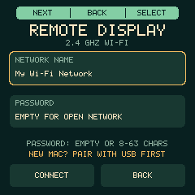
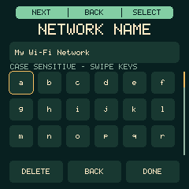

The Mac must be on a network that can reach Moss; guest/client isolation can
prevent this. Allow Local Network permission if macOS asks. The device stores
its network in flash. The app's **Manage Networks** maintains separate Mac
Keychain entries; changing one does not overwrite Moss's saved network.

USB establishes the initial trusted pairing. After authentication, Wi-Fi carries
pixels, controls, acknowledgments, rotation, and optional audio. The companion
sends up to thirty strips per Wi-Fi write within a 64 KiB limit to reduce
acknowledgment round trips; with audio active it uses smaller batches to leave
room for sound. For the fastest motion choose
**Image quality → Fast** and **Compression → Adaptive**. Compression changes
automatically with the content: small updates are cropped, compressible text/UI
usually use lossless RLE or LZ4, and detailed moving images may use a full
240×240 JPEG. After 250 ms
without content changes, an exact lossless refresh of the 240×240 image is
queued. Fast mode stays at that resolution; the physical panel always fills
480×480 by enlarging each logical pixel 2×2.
The same desktop and volume controls apply. A quick PWR tap returns to connection options
and turns Wi-Fi off. App Disconnect/Quit and network failure also stop the
session; removing USB does not. Automatic USB fallback applies only before
streaming starts, using a fresh session and explicit companion handshake. A live
Wi-Fi session never silently changes transport. No plaintext Wi-Fi fallback is used.

The device retains a TLS identity and authentication token across restarts. The
Mac pins that certificate using pairing information supplied over USB, stores
the pairing in Keychain, and authenticates inside TLS before creating a desktop.
Bonjour advertises only a device ID, session nonce, and endpoint. Credentials,
keys, and tokens are excluded from firmware and companion logs; separately
created private flash/NVS backups include persisted device records. Device network
and identity records are checksummed but are not encrypted at rest. **Forget
wireless pairing…** removes the Mac's trust; USB is needed to pair it again.
Wi-Fi Networks, Browser, and Wi-Fi display mode share the network controller
and saved-network store. Browser turns the radio off after each fetch.
Actual Wi-Fi frame rate depends on signal,
network isolation/congestion, content, and the device's available processing time.

Measured on this Mac/device/network with v1.12 Fast 240 + Adaptive, excluding startup:

| Synthetic workload | Completed changed updates/second |
| --- | ---: |
| Scrolling interface | 8.9 |
| Small moving marker | 25.7 |
| Textured image motion | 7.5 |

Large moving updates previously took roughly 0.5–0.7 seconds each; scrolling now
has a 95 ms median transfer time and textured motion 130 ms. These are repeatable
test workloads, not a promise of the same rate in every app. The device's decoding
and panel drawing now account for most full-image processing time. See
[verification and benchmark evidence](docs/verification.md).

### Optional sound

Enable **Audio on Moss** in the Mac menu, then choose **Moss speaker volume**.
Audio is off by default. It carries Mac/system audio through ScreenCaptureKit;
audio is not limited to windows physically positioned on the Moss screen. No
microphone input is opened. The stream is mono PCM at 16 kHz (32 KB/s), with
bounded buffering and a conservative speaker volume limit. It is intended for
simple sounds and speech rather than high-fidelity or synchronized movie playback.
It consumes additional CPU, memory, Wi-Fi bandwidth, and battery power, and can
reduce refresh rate. Turn it off for maximum display performance.

With firmware v1.13 / companion v1.5, the same synthetic workloads measured:

| Workload | Audio off | Audio on |
| --- | ---: | ---: |
| Scrolling interface | 7.41 updates/s | 5.53 updates/s |
| Textured image motion | 5.83 updates/s | 5.72 updates/s |

These are acknowledged changed updates, with two seconds of startup excluded.
Network conditions varied between runs; they show the practical cost rather than
a fixed audio penalty. Sound can have gaps during heavy image updates. A direct
Wi-Fi tone test, with the Mac silent, confirmed the device speaker. Full results
and test limits are in [verification](docs/verification.md).
