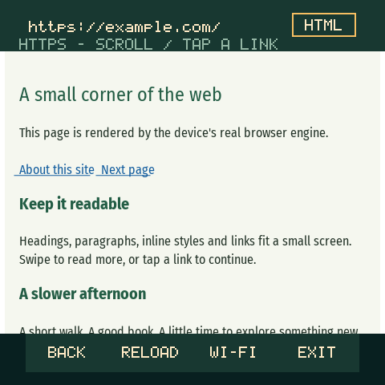

# Standalone browser

The normal firmware includes **Browser** in the main menu, between Games and
Wi-Fi Networks. It defaults to a streaming reader with SD-cached images, with the pinned
libwebsockets LHP HTML/CSS renderer available through the READ/HTML toggle.
Both fetch directly over Wi-Fi on the ESP32-C6. No companion is required.
Graphical mode supports bounded external CSS and JPEG/PNG images backed by the
FAT32 microSD cache. Reader mode remains the default.

## Using it

1. Open **Browser**. The main menu scrolls vertically; swipe or use Next to
   reveal its entries. The initial address is `https://news.ycombinator.com`.
2. If no network is saved, the shared **Wi-Fi Networks** screen opens. Select a
   network, enter its password, and connect; the browser resumes automatically.
   This is the same network controller, editor, and persistent store used by
   Remote Display. Returning without connecting leaves the browser idle.
3. Tap the address bar, then tap keys to enter a URL. Swipe the keyboard to reach
   more characters. The scrollable keyboard preserves case
   and has all printable ASCII characters. Select **GO** to load. A bare host
   uses HTTPS; explicitly enter `http://` for an unencrypted site.
4. Tap **READ** at the top right to switch to the experimental graphical HTML
   view; tap **HTML** to return to the reader. The change reloads the current address.
5. Drag the page vertically and tap links. The footer offers Back, Reload/Stop,
   Wi-Fi, and Exit. The left hardware button advances focus; the right selects.
   Hardware focus includes Scroll Up and Scroll Down. PWR cancels the editor or
   goes back through history, then asks before exiting. Exit and Wi-Fi also show
   **Stay / Exit**, with Stay selected by default; touch and hardware controls work.
   Back dismisses the dialog. Loading shows the destination URL across up to three
   lines (114 characters, ending in an ellipsis when longer).

URL entry uses the same allocation-free `Keyboard` module as Wi-Fi credentials,
pet names, and score names. All use six columns of 34 × 28 logical-pixel keys (30 visible at once),
swipe scrolling, one row of editing/submit controls, and Next/Select navigation.
The input and count share a compact line above the keys. PWR or the top Back
control cancels; score entry retains a separate Skip action in its footer.
The caller supplies its character set, bounded draft, validation, masking, and
commit/cancel behavior. The browser builds eight logical rows at a time in a
shared 3,840-byte scratch buffer; it does not allocate a keyboard framebuffer.

Back keeps four previous addresses in RAM and reloads the selected address.
History and page contents are discarded on exit or when entering Wi-Fi setup.
There are no tabs, cookies, password manager, or browser accounts.

These are host-rendered previews of the actual UI and renderer; the example
page is a local HTML fixture, not a live website capture.




## What fits

| Resource | Current bound |
| --- | --- |
| Native page viewport | 480 × 352 pixels; content inset 6 native pixels at each side; controls inside rounded corners |
| Text source | Streams up to 512 KiB of HTML or Atom; no full source buffer |
| Text document | 512 lines × 39 ASCII columns, 320 URL entries, 16 KiB URL table; 12 inline image blocks |
| Text rendering | 20 native pixels per line, blue underlined links; eight-row stripes |
| Graphical HTML body | 32 KiB fetched HTML/XHTML; up to 64 KiB after inserting external CSS |
| External CSS | First two eligible stylesheets, at most 8 KiB each; no recursive imports |
| Images | First 12 eligible image blocks/attempts; JPEG, gray/RGB/RGBA8 PNG, indexed PNG1/2/4/8; 512 KiB compressed each |
| Image decoding | One decoder; JPEG 96 KiB / PNG 64 KiB requested allocation budget; original source at most 1280 × 2048; cached aspect-fit within 320 × 320 native pixels (160 × 160 samples for READ) |
| SD cache | 32 slots in MOSSWEB; decoded RGBA rows or CSS, under 13 MiB plus bounded temporary files |
| URL | 511 ASCII bytes; IPv4 / DNS hosts |
| Redirects | Three; HTTPS → HTTP is rejected |
| HTTP headers | 6 KiB total, 511 bytes per line |
| Graphical retained page | Up to 8192 pixels high; deeper DLO trees fail visibly |
| LHP heap | At most 128 KiB, reduced to preserve 48 KiB of free heap |
| Browser display scratch | 3840 bytes for reader/UI stripes; separate 1920-byte LHP sink; no full framebuffer |
| Loading | 60-second main fetch plus at most 60 seconds for all subresources; bounded connection phases; Stop supported |

Reader mode strips scripts, styles and markup incrementally, wraps words,
and retains bounded text, link targets and image references. Text and URL storage
grow in small chunks with actual content, avoiding a fixed 46 KiB reservation
while the next image handshake needs TLS memory. It chooses smaller
`srcset` variants (width and density descriptors), including lazy `` tags
already present in server-rendered HTML. It ignores SVG/GIF/WebP/AVIF, data URLs,
and explicit 0–2 pixel layout/tracking images. Linked pictures remain tappable.
A missing/unsupported image retains its alt-text placeholder. Images after the
12-block limit are omitted; all remaining text is still parsed. Reddit addresses use the public Atom
feed (`/.rss?limit=12`) for front pages, subreddits, posts and available comments.
The address bar and history retain the requested Reddit address. Listing feeds
add **MORE POSTS** using the last post ID. Hacker News uses ordinary HTML, including
story discussion pages and its More links. Private, login-only or blocked feeds
remain unavailable. A 429 rate-limit response asks the user to wait and reload;
the browser does not automatically retry, change identity or switch endpoints
to evade a site refusal. This adds no account login, voting, posting or media playback.
Non-ASCII characters outside common punctuation display as `?`. A full document
or URL table is visibly marked as clipped; follow links for smaller pages.
An empty JavaScript shell shows an explanation instead of a blank page.

The shared network service initializes persistent SDK infrastructure before the
browser takes ownership. The pet's **115,200-byte canvas stays allocated** and is
loaned to a private, aligned arena for transient TLS, reader and LHP allocations.
The arena splits/coalesces blocks and falls back to ordinary heap allocation when
needed. The mbedTLS allocator API uses this same service; outside browser ownership
it uses the normal heap. No browser consumer can overlap Remote Display or radio
exploration. Fonts and browser code remain in flash.

Navigation first cancels and drains the previous worker, releases its document,
and then starts Wi-Fi/TLS. Text parsing overlaps streaming; the parser scratch
state, TLS and sockets are released before the page is published. Reader images and graphical subresources then download serially to SD, with each TLS connection
closed before image decoding. Wi-Fi stops before rendering. Scrolling retains the
text document or LHP display list plus a shared SD window and one visible-image file handle. Exit waits for the worker and engine cleanup, then returns the identical
reserved allocation to the pet. It no longer depends on finding a contiguous
115,200-byte free block after network allocations have fragmented the system heap.
Heap integrity, arena live/peak usage and reader line/link counts are available as
numeric-only diagnostics.

The microSD card backs images in both modes; text needs no card. Storage diagnostics remain
read-only and never format it; the browser's separate file session writes only
its private `MOSSWEB` cache directory. The card supplies backing storage, not
TLS working memory or extra CPU-addressable RAM. A missing, incompatible or failed
card leaves text browsing and embedded styles available; the status reports
that the SD cache is unavailable.

LHP renders text, links, HTML structure, colors, borders, and supported inline or
embedded CSS. It is experimental and is not a standards-complete browser.
JavaScript, website fonts, forms, general file downloads,
compressed responses, raw Unicode hostnames, and IPv6 are unsupported here.
The request asks for identity encoding. In graphical mode, large pages and pages with a complex
layout fail with a visible message. Text mode has the separate bounds above. JavaScript applications and YouTube playback
are not supported. No claim of arbitrary modern website compatibility is made.

HTTPS requires hostname and certificate-chain verification against the ESP-IDF
trust bundle; there is no insecure fallback. An unset system clock is seeded
from the RTC or synchronized by SNTP over Wi-Fi before HTTPS, including when an
HTTP address redirects to HTTPS. This does not write to the RTC. A failed clock
sync or certificate check produces an error. Plain HTTP retains its `http://` scheme in the address bar.
LHP itself never services network requests. The bounded worker fetches eligible
CSS and image URLs with the same verification and redirect policy; HTTPS pages
cannot load HTTP subresources. CSS imports, CSS background URLs, script fetches,
`data:` and `file:` assets remain disabled. URLs, keyboard input, and page content are not added to serial logs.

## microSD compatibility and ownership

The installed SDK disables exFAT. The user's 128 GB card was positively identified
as exFAT and converted, with permission, to an MBR-partitioned FAT32 volume with
32 KiB clusters and two FAT copies. A temporary maintenance image verified a
create/write/close/reopen/read/delete cycle. That formatting path is absent from
normal firmware; it did not change the internal flash partition layout or NVS.

A long FAT scan also exposed a shared-bus SPI HAL assertion when SD polling and
LCD DMA overlapped. Storage now paints Checking before taking exclusive bus
ownership, then releases the display only after the filesystem and SD-device
cleanup finish. Large-card free-space scans are bounded to sixty seconds, and
the diagnostics adapter remains read-only. The browser file session enables
writes without any format/trim path, skips the full free-space recount, and shares
an allocation-free, recursive SPI ownership guard with every LCD transfer. File
reads/writes are at most 4 KiB per operation, with two-second operation deadlines
and one-second write-command ceilings. LCD ownership lasts through DMA completion.
SD handles close and the card unmounts before another app can take ownership.

## Text scrolling

The original reader painted eight single-row transfers per main-loop turn. A
viewport needed 25 turns, separated by the firmware's 5 ms loop delay, and each
new drag sample restarted that partial redraw. Empty touch events also marked
browser controls dirty. This created visible page wipes despite the modest text
layout.

The reader now finishes a viewport in one turn using 25 eight-row transfers,
matching the existing display DMA stripe height. Drag samples received before
painting coalesce to the latest offset. Unchanged offsets, empty contacts and
non-link taps do not repaint, and scrolling leaves the header/footer alone.
The only extra scratch allocation is 3,840 bytes; no page framebuffer or SD
traffic is needed. The loop yields between transfers. It still redraws visible
text rather than scrolling panel memory, and the graphical LHP mode retains its
separate incremental renderer. Device paint timings are exposed as numeric
`paint_us` and `paints` diagnostics; they exclude touch polling and chrome.

## Graphical assets in v1.36

`<link rel="stylesheet">` resources are inserted at their original document
position as embedded styles, preserving cascade order. Styles intended only for
print, alternate sheets, raw script/style contents and recursive imports are not
fetched. Supported inline/embedded CSS continues to use the pinned LHP subset:
block/inline flow, colors, borders, padding, text sizing and some flex layout.
This is not full CSS or JavaScript compatibility.

JPEG/PNG files download to a temporary file and decode one line at a time after
TLS cleanup. The already-linked LHP codecs supply RGB/grayscale/alpha pixels;
this adds no new image library. Images are downscaled with nearest-neighbor
sampling while retaining their aspect ratio. The cache stores RGBA rows, so
repaints need no decompression and PNG alpha blends against the current page.
Reader entries store the actual logical image samples (at most 160 × 160),
separately from full-resolution HTML entries (320 × 320). The panel doubles the
reader pixels anyway; this removes three quarters of its SD image traffic
without reducing visible reader detail.
A single 4 KiB read-ahead window and one open file serve all retained images.
The SDK embeds a further 4 KiB cache in each FatFS `FIL`, so no decoded image
file stays open during subsequent TLS handshakes. Image metadata pins cache
slots without pinning file handles. Decode temporarily needs two file handles. Supported
HTML/CSS image dimensions and links use LHP's existing flow and hit-test logic.
v1.37 also accepts indexed PNG with 1/2/4/8-bit indices and palette alpha.
A bounded adapter validates palette/alpha chunks, exposes packed indices to the
same linewise inflater, and expands them while writing scaled RGBA. Interlaced
and 16-bit PNG, WebP, AVIF, GIF and SVG remain unsupported. Progressive JPEG uses
the codec's coarse DC preview, enlarged to the bounded source aspect ratio; it
does not have the detail of a full progressive decode.
Missing or rejected images are skipped, with counts in the status line; there is
no network retry loop or fallback to another codec. The cache version changes
with this decoder update, so older tiny JPEG entries are not reused.

Cache entries contain the complete resolved URL, dimensions, byte count and
expiry. A hit requires the matching URL/type and exact bounded file size.
Only explicit `Cache-Control: max-age` responses are reused, capped at one hour;
no-store/no-cache/private, Vary and Set-Cookie responses use temporary page data
and are deleted on release. The fixed 32-slot table bounds disk use, with slots
in use by the current page pinned. A complete file is closed before publication;
failed/cancelled output is removed. Files left by interrupted power are never
reused unless their header, expiry and exact length validate. No settings or
other SD directories are touched.

The fetch worker has a 16 KiB stack; temporary asset job/URL storage lives on
the heap to leave room for certificate verification beneath the cache scanner.
The fetch worker, decoder, display list and file session have sequential
lifetimes. Stop or confirmed Exit requests cancellation; ownership returns only
after worker cleanup and all handles close. Opening the confirmation does not
cancel the load. Stay restores the page/scroll offset, and a user-held dialog
cannot exhaust the renderer's layout/paint watchdog. Graphical scrolling still
uses incremental LHP rendering, so it need not match the faster text/menu path.
Physical card removal is not automatically retried; missing rows are skipped and
later navigation may remount the card.

Numeric diagnostics include `images`, `css`, `cache_hits`, `assets_skipped`, and
`sd_cache`; no URLs or page content are logged. Real-codec host tests cover alpha,
image links, CSS placement, cache reuse, truncated entries, failed writes,
missing SD, cancellation and cleanup, in addition to the target validation in
[verification.md](verification.md).

## Rounded screen and personal sites in v1.37

Browser geometry is shared in `browser_viewport.h`: logical rows 32–207 belong
to the page, with a three-pixel gutter on each side. The address bar starts at
(18, 8), the mode control ends at x=222, and the footer buttons span x=16–223
within rows 208–231. The outer rounded corners contain no interactive labels.
Touch coordinates, reader wrapping, LHP layout width, native stripe placement,
link hit tests and the USB test helper use this geometry.

Reader mode is the useful compatibility path for server-rendered personal sites.
Two portfolio sites were used for compatibility checks (personal URLs omitted).
One uses indexed PNG logos and responsive URLs. The other redirects to its
canonical host; its roughly 469 KB HTML includes readable content and images but is too
large for the experimental 32 KB HTML mode. The reader consumes that source
without retaining hydration scripts, and places cached pictures between text
blocks. Transparent logos use a neutral matte so white artwork is visible.
It does not reproduce Tailwind animations, canvas effects, website fonts,
JavaScript interaction or embedded video players. Some JPEG variants may still
be rejected; the page remains usable and reports skipped image attempts.

## Original feasibility assessment — 2026-10-04

This assessment preceded v1.36. The bounded graphical implementation above now
implements part of this plan; the remaining compatibility limits still apply.
A standalone reader with bounded images and simple styled pages is plausible.
Arbitrary modern web-app compatibility is not a realistic goal for this board.
The [board specifications](https://docs.waveshare.com/ESP32-C6-Touch-AMOLED-2.16)
and actual build establish a 160 MHz ESP32-C6, 16 MB flash and 480 × 480 screen;
this board has no PSRAM. The current app uses about 2.42 MB of its 8 MiB app
partition. Code space is less restrictive than transient working RAM: the final
v1.35 device run reached 31.5 KiB free general heap, even with the reserved
112.5 KiB canvas arena. Free heap at the menu is not an image decoder's guaranteed
budget during TLS or layout.

| Capability | Assessment and first implementation boundary |
| --- | --- |
| JPEG pictures / thumbnails | Feasible with source dimension, compressed-size and time limits; one decoder at a time, streamed output and explicit downscaling. Start with baseline grayscale/YCbCr. |
| PNG and transparency | Feasible selectively; reserve decoder memory after TLS closes, composite one line/strip at a time, reject excessive dimensions and initially interlaced files. |
| Basic CSS and layout | Already partly present in the graphical engine: block/inline flow, colors, borders and embedded styles. The pinned source includes row flex layout and some media-query processing. Compatibility needs fixtures and device budgets. |
| External stylesheets | Requires a new bounded subresource loader; limit sheet count, bytes, redirects, origin count and nesting. The existing integration blocks every subresource. |
| WebP / AVIF, animated GIF, SVG | Defer. Each adds format-specific working memory, CPU and malformed-input handling; not prerequisites for the first useful image mode. WebP is not intrinsically impossible, but requires its own target benchmark. |
| Full CSS / JavaScript applications | Not realistic here. LHP explicitly does not implement grid; a subset of flex does not imply browser-grade CSS. Modern Reddit's web application and YouTube playback are not unlocked by adding images. |

The pinned LHP build already enables JPEG and PNG codecs because the engine
references them. At the time of the assessment, assets were disabled by our integration, not by
absence of all codec code. Its actual [JPEG drawing code](https://github.com/warmcat/libwebsockets/blob/75b415f4afd5b542badbbf87b6ffec56f3cf3cfc/lib/misc/dlo/dlo-jpeg.c)
already scales into an image box. This source is newer than parts of the published
LHP overview, so older blanket statements that it cannot scale images or process
inline styles are not an accurate description of this pinned revision.

Two decoder paths merit measuring. LHP's streaming JPEG implementation retains
roughly 2.1 KiB plus 8 or 16 source-width rows of component data; scaling its final
output does not remove that source-width allocation. A 4,000-pixel-wide RGB
16-row strip alone is 192,000 bytes. The already-vendored
[JPEGDEC library](https://github.com/bitbank2/JPEGDEC) supports SD callbacks and
1/2, 1/4 and 1/8 decoding scales; its progressive support is DC-only thumbnails,
not full progressive rendering. Our current Remote Display adapter restricts it
to 240 × 240 baseline 4:2:0 and a full logical canvas, so web images need a
separate adapter around the shared codec. [PNGdec](https://github.com/bitbank2/PNGdec)
provides line callbacks and RGB565 conversion but documents at least 48 KiB free
RAM and excludes interlacing. It is an alternative to evaluate, not a dependency
added here.

A 480 × 400 RGB565 viewport costs 384,000 bytes; a complete 480 × 480 screen costs
460,800 bytes. Even a 160 × 120 thumbnail costs 38,400 bytes if retained as pixels.
Instead, preserve compressed files on SD and optionally cache fitted RGB565
strips/tiles for repaint. A small fixed RAM tile cache can avoid repeatedly
reading or decoding the same visible image during a drag. SD is explicit backing
storage, not automatic extra RAM. It shares SPI with the display, so filesystem
access and panel DMA require one coordinated owner and bounded transactions.

Original staged proposal (superseded in part by the v1.36 implementation above):

1. Add a shared bounded SD file/cache service, with one filesystem owner, explicit
   read/write errors, removable-card handling, eviction, and cleanup on app exit.
   Keep the text-only path functional with no card. Mount before browser memory
   peaks, then reuse the existing app ownership lifecycle.
2. Add an opt-in or tap-to-load JPEG attachment/thumbnail to the reader. Fetch
   sequentially with verified HTTPS to a temporary SD file, enforce limits while
   streaming, close TLS, validate dimensions/type, then decode within a fixed
   budget. Rename only complete cache entries; cancelled/failed files are removed.
3. Preserve aspect ratio, use at most the viewport width, cache fitted strips,
   and retain a placeholder/alt text on failure. Source size limits must precede
   decoder allocation; a small compressed file can still have huge dimensions.
4. Measure PNG separately, then wire the same asset service into LHP and add a
   tightly bounded external-CSS pass. Prefer single-column presentation on this
   screen. Do not permit unbounded import chains or simultaneous TLS/decoder peaks.
5. Gate on real-device scrolling, malformed/truncated files, card removal, repeated
   page changes and app exits, with heap integrity and zero outstanding allocations.
   Establish measured limits before promising general site compatibility.

## Building without a device

The normal `scripts/build.sh` now builds the full browser firmware. It needs the
repository's Arduino-ESP32 3.3.0 toolchain, Python 3, CMake 3.24+, and Make or
Ninja. The checksum-pinned source archive is downloaded on first use and kept in
`build/lhp-browser/application/`. The build does not open or flash a device.
For a separately installed toolchain or an offline archive:

```sh
python3 scripts/lhp-target-build.py --application \
  --archive /path/to/pinned-source.tar.gz \
  --arduino-data /path/to/arduino-data \
  --arduino-cli /path/to/arduino-cli \
  --work /tmp/moss-browser-build
```

`--work` must be empty or already owned by this builder. The script stages the
sketch and static library there, then writes `build-report.json` with the source
revision, image size/hash, and explicit runtime verification status. Omit
`--application` to build the original isolated offline experiment instead.
The existing 8 MiB app partition and NVS locations are unchanged by this feature.

Upstream is pinned to
[`75b415f4afd5b542badbbf87b6ffec56f3cf3cfc`](https://github.com/warmcat/libwebsockets/tree/75b415f4afd5b542badbbf87b6ffec56f3cf3cfc).
The target builder applies three exact changes to its generated source copy:
it skips the unused global GPIO ISR installation and event-pipe sockets, and
routes CSS/glyph arena chunks through the bounded LWS allocator. LHP's event
loop is never run by this renderer. Avoiding its wakeup sockets also avoids a
first-use main-task lwIP semaphore that could occupy the released pet canvas.
The builder fails if expected source no longer matches and records each patch
in its report. Host renderer tests use the same patches in a private copy.
Parser logs use a private sink; the UI and numeric diagnostics report errors
without page contents or persistent libc stream buffers.

The archive SHA-256 is
`6a5a4b0c71867dcac5eb89b2ce16010c86d6c3a73631d29085b29f21c8fa52e8`.
Preserved notices: [libwebsockets and its components](third-party/libwebsockets-LICENSE.txt)
and [Fira Sans fonts](third-party/FiraSans-OFL.txt).

## Verification

`scripts/test.sh` covers the UI, URL resolution, fragmented/chunked HTTP, response
limits, and the real fetch worker and controller against SDK mocks. These tests
include cancellation, stale DNS callbacks, TLS verification and truncation,
redirects, clock setup, history, editor repaint, swipe deltas, memory failures,
and cleanup order. They run under AddressSanitizer and UndefinedBehaviorSanitizer.

The [real-engine host test](../tests/browser_engine/README.md) runs actual LHP,
including its allocations, under sanitizers. It verifies pixels, scrolling,
links, blocked assets, depth/size limits, timeout and panel failures, and cleanup
at 105 construction/layout budgets and 49 paint budgets. A representative small
document peaked at 30,513 tracked
bytes on the host; this is not a measured ESP32 heap requirement.

The complete ESP32-C6 firmware was built, flashed at the existing app offset,
and verified by a device-side digest on 2026-10-03. The bootloader, partition
layout, and saved network were preserved. Direct `https://example.com` returned
HTTP 200 and rendered successfully using the saved Wi-Fi network. Canvas
reclamation was checked on the physical device after loading. The live suite
passed 43 state checks across the main run and its continuation: long-page scrolling, relative links, Back, Reload,
editor cancellation/repaint, chunked HTTP, body/content-type limits, invalid
TLS certificates, DNS failure, Stop, screen-off cancellation, ten repeated
HTTPS open/close cycles, and the shared Wi-Fi picker handoff. Stop completed in
0.83 seconds. The public expired-certificate endpoint timed out from the device
and also failed from the Mac; a reachable local self-signed HTTPS fixture was
rejected with the expected TLS error. The successful checks were retained and
the suite continued without a reset or firmware change. A subsequent USB Remote
Display test acknowledged every native,
fast, compressed, raw, and partial-update packet. Browser then rendered HTTPS
again before returning to pet home. After this cross-mode test, the reported
lifetime minimum was 56,028 bytes and free heap at pet home was 104,508 bytes.

During the browser suite, ESP-IDF reported a lifetime heap minimum of 69,792
bytes; the lowest sampled free heap was 71,960 bytes. The fetch worker's smallest
remaining stack was 7,080 of 12,288 bytes. All heap-integrity checks passed. The 1,441-byte long-page fixture produced a 1,339-pixel document and
peaked at 91,761 tracked LHP bytes after scrolling. These measurements apply
to these fixtures,
not every website. The actual panel received drawing commands, while typography
and physical touch feel still need human visual confirmation.

Browser integration build, v1.29 (Arduino-ESP32 3.3.0; see
[verification](verification.md) for the subsequent menu and touch updates):

| Measurement | Result |
| --- | --- |
| Program storage | 2,406,763 / 8,388,608 bytes (28.7%) |
| Static RAM | 101,024 / 327,680 bytes (30.8%) |
| Linked RAM remaining before runtime allocations | 226,656 bytes |
| Binary image length | 2,406,864 bytes |
| Flashed / digest verified | Yes / Yes |

Image SHA-256: `3342026acdb7911edc44c36b12e598ef93af2b06f13bccd16e8b953bcb73f189`.
All staged firmware source files were compared with the worktree after the build.
The linked RAM figure excludes dynamic allocations and is not a free-heap reading.
Individual native parser or crypto calls cannot be preempted by the cooperative
deadlines. This is a bounded experimental HTML browser, not a compatibility
certification for arbitrary sites.

A remaining shared Wi-Fi limitation was isolated separately: repeated
Settings-only scan/connect/disconnect cycles also reduce free heap by roughly
0.2 KiB per cycle, without any browser, HTTP request, TLS, or fetch task. Free
heap after the ten browser exits fell from 107,088 to 104,980 bytes. Some
small IP-loss timer allocations return later, but a steady-state plateau has
not been established. The successful shared join/stop sequence matches the
pre-browser implementation. Repeated browser exits work, but this is not a
multi-hour memory-stability certification; reconnect retention remains open.

## On-device test helper

`scripts/browser-device-check.py` requires an explicit `--port`. It can read
status, open the browser, enter a URL through the actual keyboard, or exit. It
never flashes, bypasses the network selector, or provisions credentials. A saved
working Wi-Fi network is required. Close the display companion before using it.

```sh
.tools/venv/bin/python scripts/browser-device-check.py \
  --port /dev/cu.usbmodem101 --url https://example.com --exit-after
```

The `s` diagnostic now includes `BROWSER` with numeric phase, UI state, HTTP
status and body count, error codes, LHP heap use, scroll position, worker stack
headroom and largest free heap block. `I` checks heap integrity. Phases are
Idle=0, Cancelling=1, Joining=2, Clock=3, Fetch=4, Render=5, Ready=6, Closed=7.
After browser network initialization, an optional `TCP` line reports only
connection-state counts. URLs, HTML, peer addresses and credentials are not included.

## Foreground resource lifetime (v1.38)

The 115,200-byte canvas stays reserved at one stable address. `AppWorkspace`
allows only one foreground borrower: the browser arena or Remote Display
decoding. Browser exit drains its worker and engine allocations before returning
the canvas; freeing/reallocating this large block would risk fragmentation.

The browser stripe painter lives in its temporary app object. Remote Display's
large packet buffer exists only during a session; a small inline control buffer
continues to handle discovery and RELEASE after exit. Its Wi-Fi queues are
allocated on start and reaped by the main loop only after the worker's final
queue access. Radio discovery lists/sweep state also exist only while open.
Read-only LHP CSS lookup tables reside in flash. Small core state and SDK
network infrastructure remain resident; this is selective buffer ownership,
not executable-code unloading or paging to SD.

While browsing or streaming, routine HUD polling, deferred settings/scores/humor
writes and periodic pet saves wait. Entry saves a timestamped pet snapshot;
return/actions advance the existing pet timeline over elapsed time. Hidden pets
do not need per-frame meter updates. The shared workspace, receive buffer, Wi-Fi
queues, radio UI and browser arena are reported by numeric `APP_MEMORY`
diagnostics, alongside the existing heap-integrity checks.
